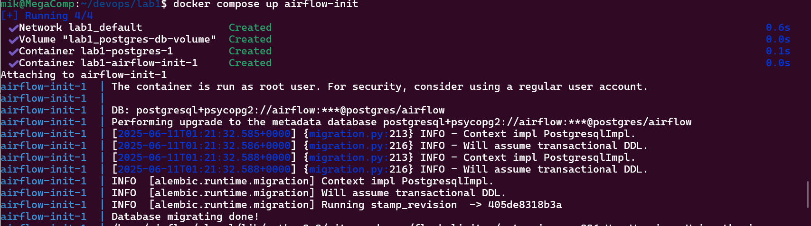
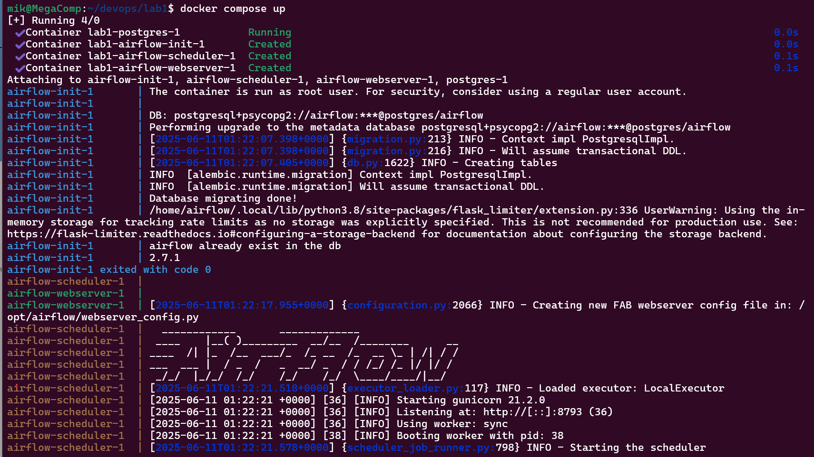
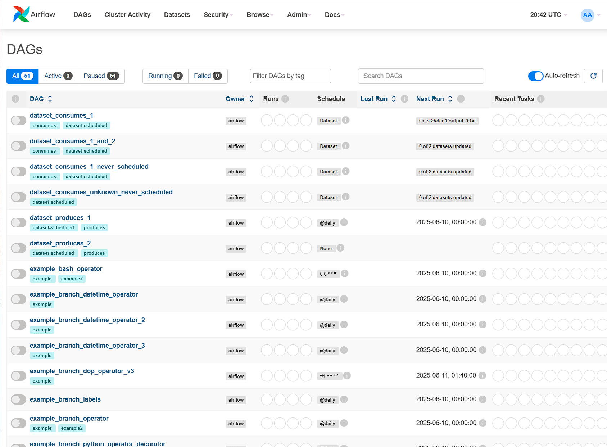

# Лабораторная работа №1.

## Цели работы:
Развернуть Apache Airflow с помощью docker-compose

## Выполение работы:
### 1. Скачиваем docker-compose файл apache-airflow:
```bash
curl -LfO 'https://airflow.apache.org/docs/apache-airflow/2.10.5/docker-compose.yaml'
```

### 2. Подготавливаем docker-compose файл.
2.1. Удаляем лишние сервисы: 

- redis;
- airflow-worker;
- airflow-triggerer;
- airflow-cli;
- flower.

2.2. Заменяем дефолтный образ на **apache/airflow:2.7.1**<br>
2.3. Меняем значение переменной  **AIRFLOW__CORE__EXECUTOR** с CeleryExecutor на **LocalExecutor**<br>
2.4. В блоке **&airflow-common-depends-on** удаляем строки, связанные с сервисом **Redis**

### 3. Создадим необхомые папки и файлы для Airflow
Если заранее не создать нужные папки, то по умолчанию они и всё их содержимое будут созданы под пользователем root, что может привести к проблемам в работе Airflow. Также необходимо создать файл .env, в котором будет переменная AIRFLOW_UID с ID текущего пользователя.
```bash
mkdir -p ./dags ./logs ./plugins ./config
echo "AIRFLOW_UID=$(id -u)" > .env
```

### 4. Запускаем Airflow
Для первого запуска Airflow сначада выполним следующую команду:
```bash
docker compose up airflow-init
```



Для последующего запуска Airflow и развёртывания всех необходимых сервисов для его работы выполняем следующую команду:
```bash
docker compose up
```



После этого можно попасть в Airflow через браузер по адресу: `http://localhost:8080/ `:


Вводим airflow/airflow и видим множество примеров DAG-ов:



## Вопросы к работе:
1. Для чего нужен docker-compose?<br>
Ответ: Docker-compose помогает легко запускать и управлять сразу несколькими связанными контейнерами. Вместо того чтобы каждый контейнер запускать по отдельности, с docker-compose всё описывается в одном файле, и одной командой запускается целое приложение со всеми нужными сервисами.
2. Как в docker-compose сделать ограничения для контейнера поресурсам (CPU, RAM)?<br>
Ответ: В docker-compose можно задать, сколько процессорного времени и памяти может использовать контейнер. Для этого в файле docker-compose.yml указывают специальные параметры — например, cpus для ограничения CPU и mem_limit для ограничения памяти. Так можно не дать одному контейнеру съесть все ресурсы компьютера.