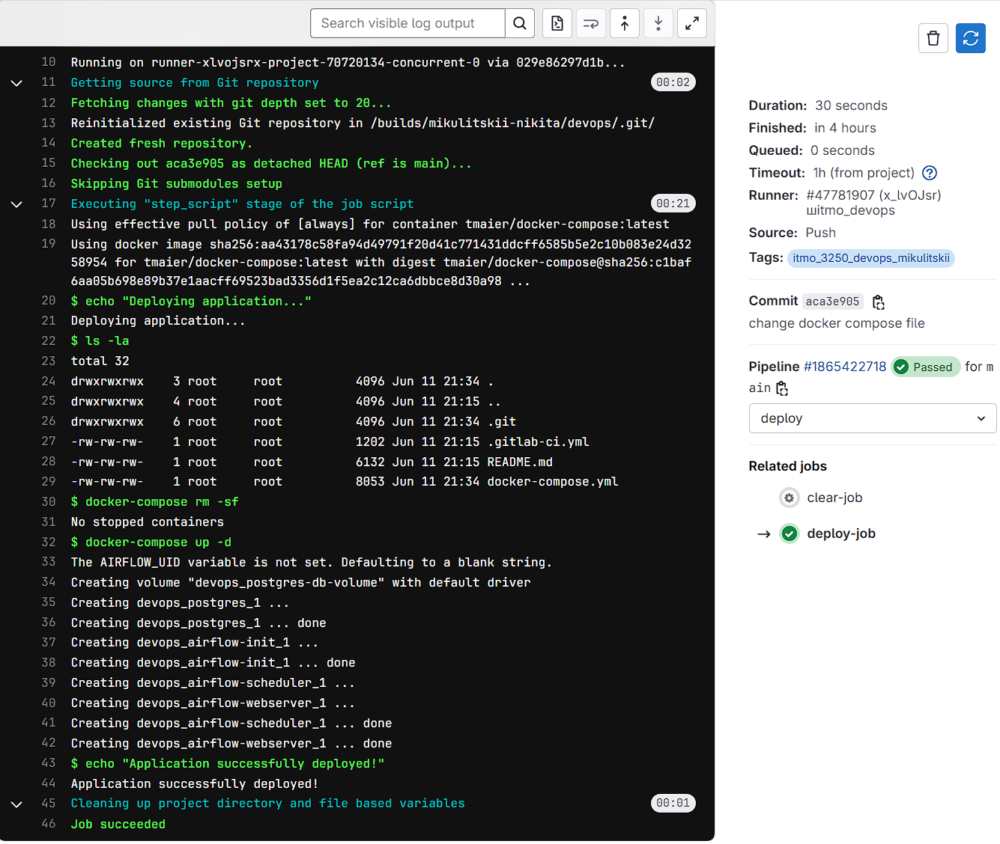
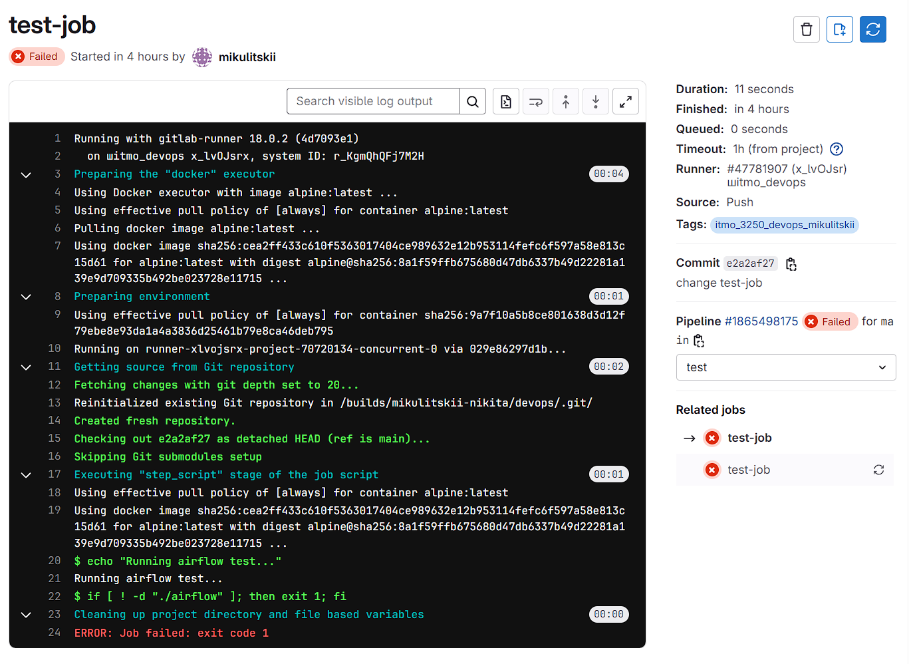

# Лабораторная работа №2. Gitlab CI/CD

## Цели работы:
Создать и настроить свой первый пайплайн в Gitlab

## Выполение работы:
### 1. Установка и настройка Gitlab
На сервере, где будет целевой деплой создаём файл docker-compose.yml для деплоя раннера:

```bash
version: '3.7'
services:
  gitlab-runner:
    image: gitlab/gitlab-runner:alpine
    container_name: gitlab-runner
    restart: always
    volumes:
      - /var/run/docker.sock:/var/run/docker.sock
```

В терминале выполняем команду `docker-compose up -d` и ждём, когда деплой завершится (проверить можно командой `docker ps`)


Далее, в Gitlab в настройках *ГРУППЫ* проектов идём в `Settings - CI/CD - Runners`, там активируем **Allow members of projects and groups to create runners with runner registration tokens**.


Потом уже в *ПРОЕКТЕ* переходим в `Settings - CI/CD`, открываем Runners. Копируем **registration token**.
</br>В терминале выполняем следующую команду для инициализации раннера:

```bash
docker exec -it gitlab-runner gitlab-runner register --url "https://gitlab.com/" --clone-url "https://gitlab.com/"
```

В процесс выполнения команды будут запрошены данные для инициализации, указываем следующие:

- URL - https://gitlab.com/ 
- Description - имя раннера (любое)
- Registration token - вставляем токен, скопированный ранее;
- Tag - придумываем посложнее (например docker_0910), чтоб не совпало с дефолтными раннерами Гитлаба
- Maintenance note - оставляем пустым
- Exectutor - выбраем docker
- Default docker image - docker:stable


После первичной иниализации раннера, необходимо его донастроить: логинимся внутрь контейнера через `docker exec -it gitlab-runner bash` и открываем файл `/etc/gitlab-runner/config.toml`.
В конце файла добавляем строчку:

```bash
volumes = ["/var/run/docker.sock:/var/run/docker.sock", "/cache"]
```

После чего перезапускаем контейнер командой `docker restart gitlab-runner`.
</br> Возвращаемся в веб-интерфейс Gitlab и проверяем, что раннер “подцепился”:


### 2. Создание пайплайна

Возвращаемся в репозиторий в GitLab. Создаём конфигурационный файл для пайплайна с именем `.gitlab-ci.yml` в корне репозитория:

```bash
stages:
  - build     # стейдж для билда образа
  - deploy    # стейдж для деплоя сервиса

deploy-job:
  stage: deploy
  image: tmaier/docker-compose:latest    # чтоб сделать деплой через композ нам нужен.. композ
  variables:
    DOCKER_DRIVER: overlay2
  tags:
    - itmo_3250_devops_mikulitskii
  script:
    - echo "Deploying application..."
    - ls -la
    - docker-compose rm -sf       # предварительно чистим уже существующее
    - docker-compose up -d        # деплоим по-старинке
    - echo "Application successfully deployed!"

clear-job:                      # дополнительная джоба, которая одноразово сотрет задеплоенное
  stage: deploy
  image: tmaier/docker-compose:latest
  variables:
    DOCKER_DRIVER: overlay2
  tags:
    - itmo_3250_devops_mikulitskii
  script:
    - docker-compose rm -sf
  when: manual                  # только ручное выполнение (после выполнения лабораторной, например)
```

После коммита файла `.gitlab-ci.yml` пайплайн запустится автоматически, ход выполнения можно посмотреть в разделе `CI/CD - Pipelines`




Если все окрашено “зеленым”, значит пайплайн успешно отработал, т.е. приложение задеплоил. В терминале можно убедиться, что тестовое приложение успешно развернулось (например, с помощью команды `docker ps`).

### 3. Выполнение задания
Необходимо сделать следующее:
- Добавить стейдж test и соответствующую джобу до этапа деплоя, выполняющую “тест” - можно сделать что-нибудь простое, например проверить что нужные директории в airflow существуют и не потерялись. Главное чтоб этот синтетический тест отрабатывал и не давал
пайплайну выполняться дальше, если джоба упала
- Добавить правило, чтоб пайплайн осуществлял шаг деплоя автоматически только для веток main и develop
- Шаг тестирования выполняется всегда во всех ветках
- Сделать так, чтоб созданный раннер мог использоваться только для тегированных джоб

Добавляем новую джобу для тестового стейджа. Пусть она будет проверяет существует ли директория /opt/airflow внутри контейнера. Назовём её `test-job`:

```bash
test-job:
  stage: test
  image: alpine:latest
  script:
    - echo "Running airflow test..."
    - test -d /opt/airflow || (echo "/opt/airflow not found!" && exit 1)
  tags:
    - docker_0910
  only:
    - branches
```

В stages добавить test до этапе деплоя:

```bash
	stages:
	  - build
	  - test
	  - deploy
```




Для джобы deploy-job  укажем ветки, на изменения в которых он будет стартовать:

```bash
   only:
    - main
    - develop
```

Для того, чтобы раннер мог использоваться только для тегированных джоб, идём в  `Settings -  CI/CD -  GitLab Runner`. Тут можно добавлять тэги раннеру.


Ссылка на репу в гитлабе: https://gitlab.com/mikulitskii-nikita/devops/